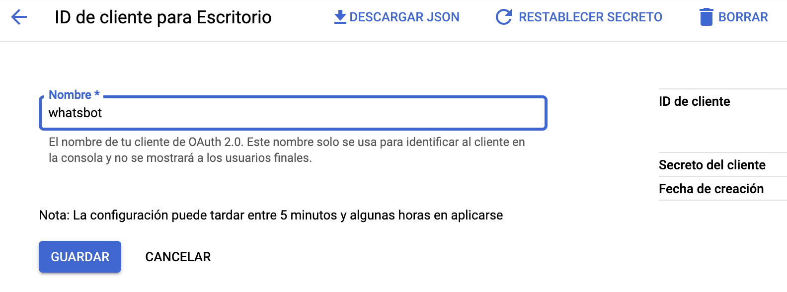

# WhastApp Calendar GPT Bot

This bot sends WhatsApp messages with Google Calendar event description for today. You can integrate OpenAI to generate messages with an artificial intelligence to get these messages like "Write a birthday greeting for Peter" as summary event.

The message will be sent to all attenders email in the event that match with wid (WhatsApp ID) format /[0-9]+@c.us/ where the user is the phone number of the contact with the prefix. If my contact is +00 123 456 789 at the event I will add 00123456789@c.us as attender.

# Configuration

Create an .env file or define the following environment variables:

```
OPENAI_SECRET_KEY=sk-...HeFI (optional)
CALENDAR_ID=86...cbf0a9fd0783c@group.calendar.google.com (primary by default)
```

If you don't set an API key for openai or add a event description, text will be sent by default.

1. Generate your OpenAI API key from https://beta.openai.com/account/api-keys
    <div></div>
2. Generate calendar for bot purposes
    <div></div>
3. Get calendar ID from Google Calendar settings
    <div></div>
4. Get credentials.json file from Google Console with credentials config
    <div></div>

Enable Calendar API and generate OAuth desktop client credential from https://console.cloud.google.com/apis/credentials and download JSON file as credentials.json

# Run

* Generate event in Google Calendar with summary "Write congratulations message for my friend Peter" and attender/s "00123456789@c.us" to generate AI message or simply add description text to send specific message.

* Install the dependencies with `npm i`
* Start the NodeJS script with `node index.js`
* Link the whatsapp account by scanning the QR code that shows the terminal

# References

* https://wwebjs.dev
* https://beta.openai.com
* https://developers.google.com/calendar/api/quickstart/nodejs
* https://www.twilio.com/blog/getting-started-with-openai-s-gpt-3-in-node-js