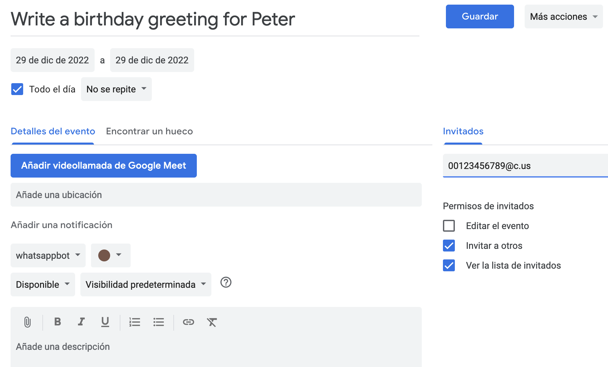
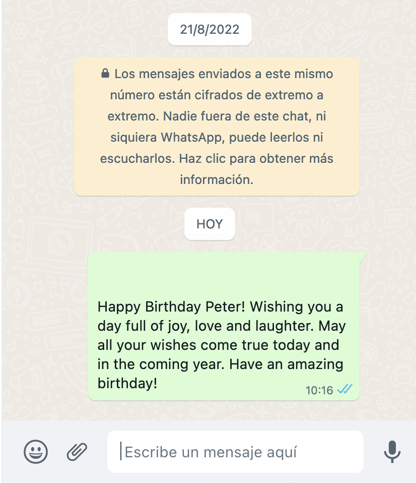
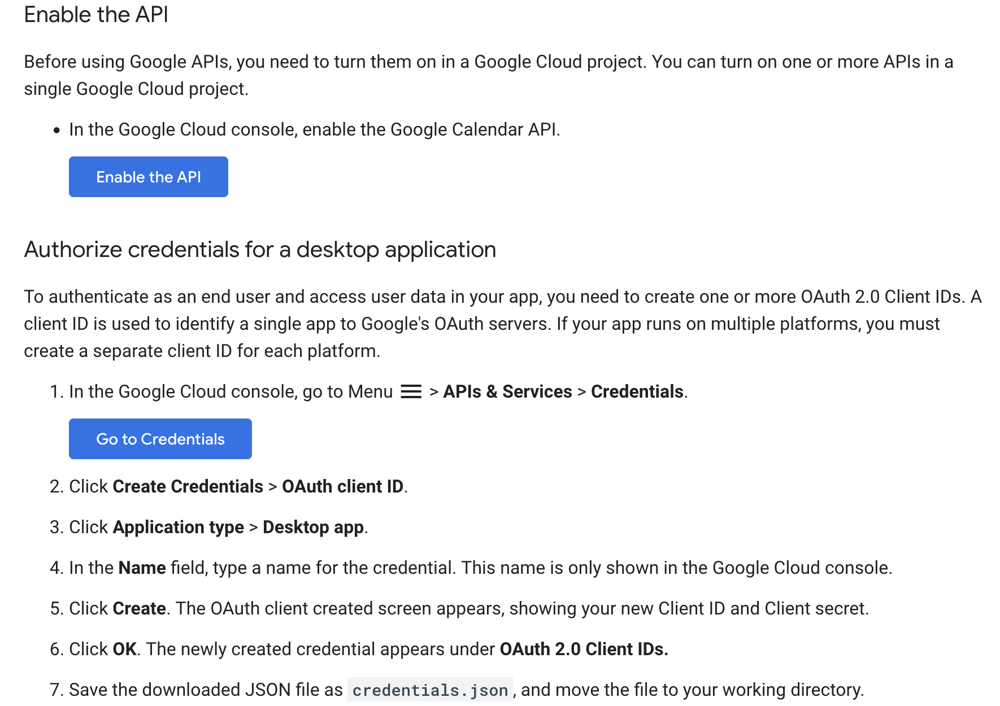
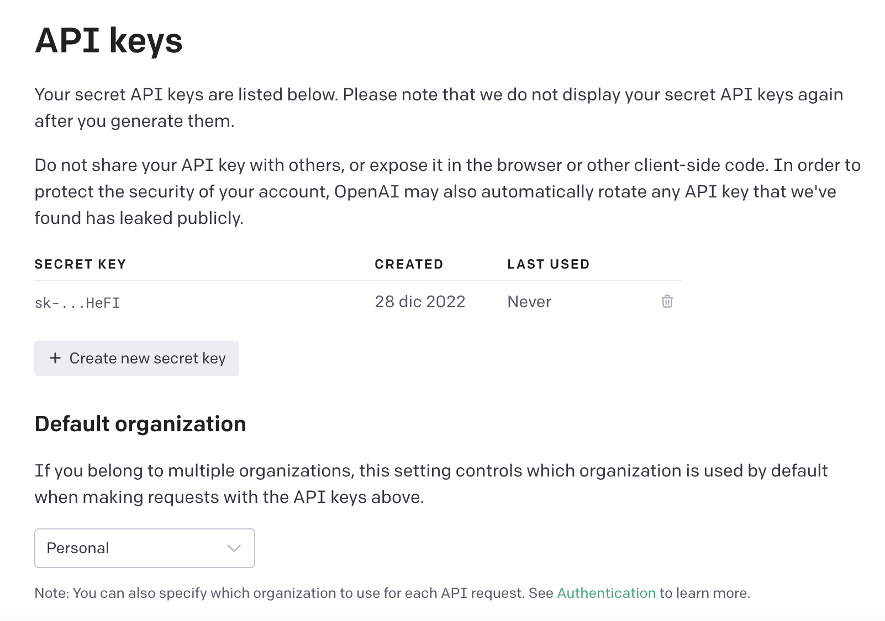
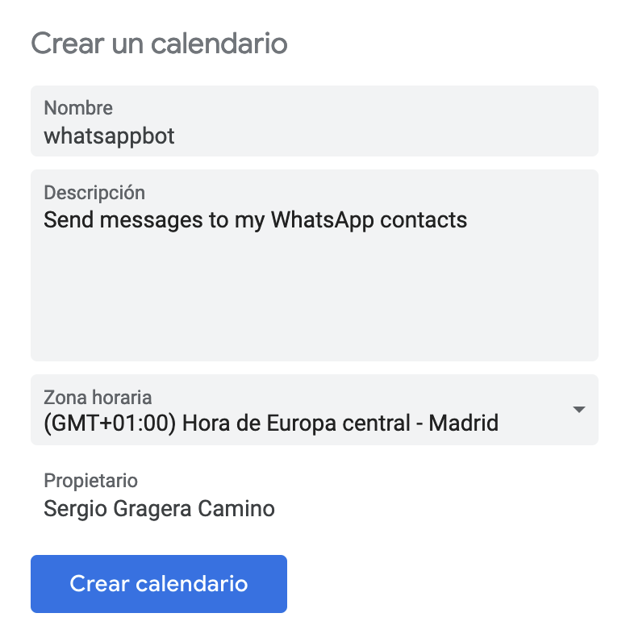
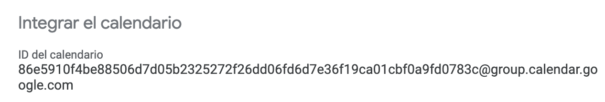
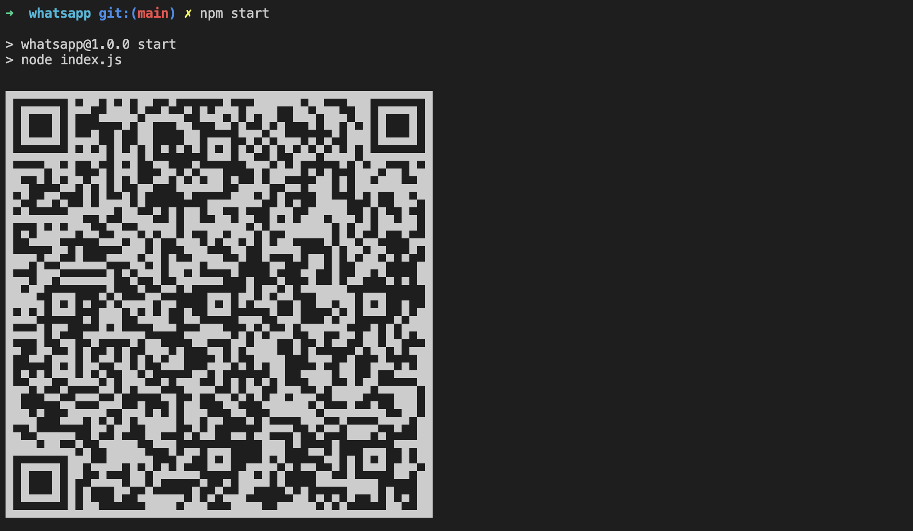

# WhatsApp Calendar GPT Bot

This bot sends WhatsApp messages with Google Calendar event description for today. You can integrate OpenAI to generate messages with an artificial intelligence to get these messages like "Write a birthday greeting for Peter" as summary event.

<div style="display: flex;justify-content: center;">&nbsp;</div>

The message will be sent to all attenders email in the event that match with wid (WhatsApp ID) format /[0-9]+@[cg].us/ where the user is the phone number of the contact with the prefix. If my contact is +00 123 456 789 at the event I will add 00123456789@c.us as attender. Domain c.us is for contact chat and g.us is for group chat.

# Table of contents
- [WhatsApp Calendar GPT Bot](#whatsapp-calendar-gpt-bot)
- [Table of contents](#table-of-contents)
- [Configuration](#configuration)
  - [Options](#options)
    - [1. Use OpenAI to generate the messages](#1-use-openai-to-generate-the-messages)
    - [2. Create an alternative calendar for this purposes](#2-create-an-alternative-calendar-for-this-purposes)
  - [Environment variables](#environment-variables)
- [Run](#run)
- [References](#references)
# Configuration

Enable Calendar API and generate OAuth desktop client credential from https://console.cloud.google.com/apis/credentials and download JSON file as credentials.json



## Options
### 1. Use OpenAI to generate the messages

If you don't set an API key for openai or add a event description, text will be sent by default. Generate your OpenAI API key from https://beta.openai.com/account/api-keys and set as `OPENAI_SECRET_KEY`



### 2. Create an alternative calendar for this purposes

Generate calendar for bot events



Get calendar ID from Google Calendar settings and set as `CALENDAR_ID`



## Environment variables
Create an .env file or define the following environment variables:

```
OPENAI_SECRET_KEY=sk-...HeFI (optional)
CALENDAR_ID=86...cbf0a9fd0783c@group.calendar.google.com (optional, primary by default)
```

# Run

1. Generate event in Google Calendar with summary "Write congratulations message for my friend Peter" and attender/s "00123456789@c.us" to generate AI message or simply add description text to send specific message. 
2. Install the dependencies with `npm i`
3. Start the NodeJS script with `npm start`
4. Link the whatsapp account by scanning the QR code that shows the terminal 

# References

* https://wwebjs.dev
* https://beta.openai.com
* https://developers.google.com/calendar/api/quickstart/nodejs
* https://www.twilio.com/blog/getting-started-with-openai-s-gpt-3-in-node-js