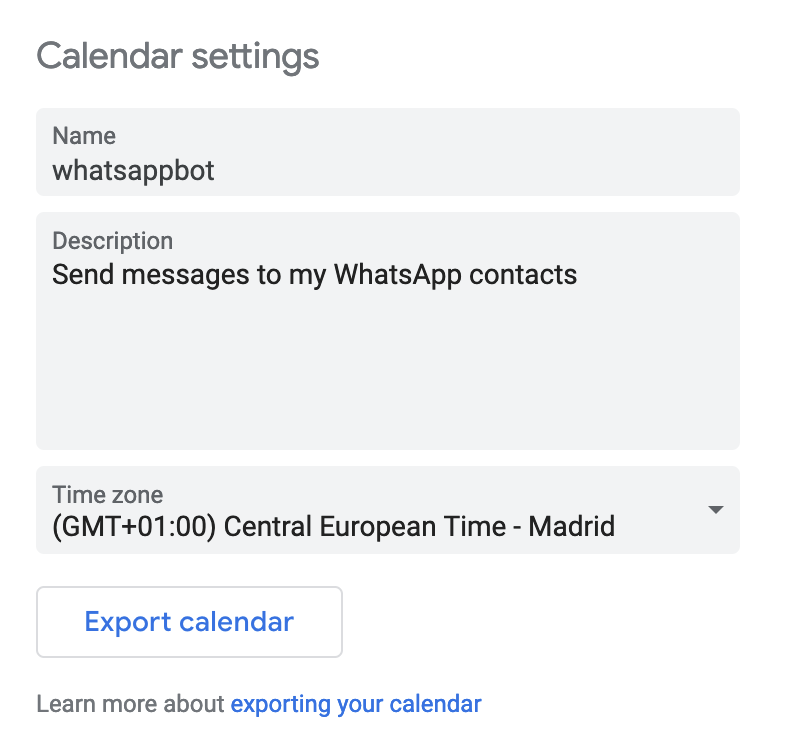

# WhatsApp Calendar GPT Bot

This bot sends WhatsApp messages with Google Calendar event description for today. You can integrate OpenAI to generate messages with an artificial intelligence to get these messages like "Write a birthday greeting for Peter" as summary event.

<div style="display: flex;justify-content: center;">&nbsp;</div>

The message will be sent to all attenders email in the event that match with wid (WhatsApp ID) format /[0-9]+@[cg].us/ where the user is the phone number of the contact with the prefix. If my contact is +00 123 456 789 at the event I will add 00123456789@c.us as attender. Domain c.us is for contact chat and g.us is for group chat.

# Table of contents
- [WhatsApp Calendar GPT Bot](#whatsapp-calendar-gpt-bot)
- [Table of contents](#table-of-contents)
- [Configuration](#configuration)
  - [Options](#options)
    - [1. Use OpenAI to generate the messages](#1-use-openai-to-generate-the-messages)
    - [2. Connect Calendar API with OAuth](#2-connect-calendar-api-with-oauth)
    - [3. Create an alternative calendar for this purposes](#3-create-an-alternative-calendar-for-this-purposes)
  - [Environment variables](#environment-variables)
- [Run](#run)
- [Develop](#develop)
- [References](#references)
# Configuration

Export and save your calendar in iCal format. Go to calendar settings and click on `Export calendar` button to download an .ics file:



Add the path to the .ics file as an argument starting the script:

```
node index.js --ical <path_to_ics_file>
```

## Options
### 1. Use OpenAI to generate the messages

If you don't set an API key for openai or add a event description, text will be sent by default. Generate your OpenAI API key from https://beta.openai.com/account/api-keys and set as `OPENAI_SECRET_KEY`


### 2. Connect Calendar API with OAuth

This option allows you to connect with Google Calendar and avoid exporting your calendar by allowing you to add events dynamically.

Enable Calendar API and generate OAuth desktop client credential from https://console.cloud.google.com/apis/credentials and download JSON file as credentials.json


### 3. Create an alternative calendar for this purposes

Generate calendar for bot events


Get calendar ID from Google Calendar settings and set as `CALENDAR_ID`


## Environment variables
Create an .env file or define the following environment variables:

```
OPENAI_SECRET_KEY=sk-...HeFI (optional)
CALENDAR_ID=86...cbf0a9fd0783c@group.calendar.google.com (optional, primary by default)
```

# Run

1. Generate event in Google Calendar with summary "Write congratulations message for my friend Peter" and attender/s "00123456789@c.us" to generate AI message or simply add description text to send specific message. 
2. Install the dependencies with `npm i`
3. Start the NodeJS script with `node index.js --ical <path_to_ics_file>` or `node index.js` with Google API credentials
4. Link the whatsapp account by scanning the QR code that shows the terminal 

# Develop
```
node index.js --help          

Usage

  node index.js 

Options

  -h, --help        Display this usage guide. 
  --ical <files>    iCal files to find events 
  --event <event>   Test event to send        

  Project home: https://github.com/sergiogragera/whatsapp-calendar-gpt-bot
```

For test purposing, the script allows an event in JSON format to throw as an argument to run the script.

1. Send a test message from description event to 0123456789@c.us:
```
node index.js --event "{\"summary\": \"Write a test message\", \"description\":\"Test message\", \"attendees\": [{\"email\": \"0123456789@c.us\"}]}"
```

2. Send a OpenAI generated message from summary to 0123456789@c.us:
```
node index.js --event "{\"summary\": \"Write congratulations message for my friend Peter\", \"attendees\": [{\"email\": \"0123456789@c.us\"}]}"
```

# References

* https://wwebjs.dev
* https://beta.openai.com
* https://developers.google.com/calendar/api/quickstart/nodejs
* https://www.twilio.com/blog/getting-started-with-openai-s-gpt-3-in-node-js